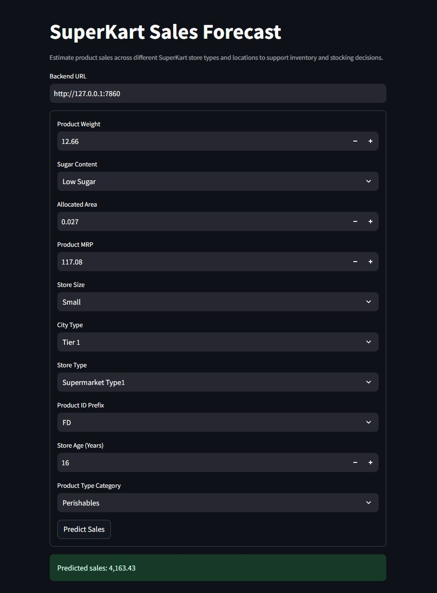

# SuperKart Model Deployment

A containerized machine-learning application for predicting SuperKart product sales.

The project consists of:

- A Flask API backend serving the trained sales forecasting model
- A Streamlit frontend for interactive predictions
- Docker containers for both components
- GitHub Codespaces for running the deployed application

## Application UI

The Streamlit interface allows users to enter product and store information and generate a sales prediction using the deployed machine-learning model.



## Running the Application

The backend runs on port `7860` and the Streamlit frontend runs on port `8501`.

### 1. Build and Run the Backend

```bash
docker build -t superkart-backend ./backend_files

docker run -d \
  --name superkart-backend \
  --network host \
  superkart-backend
```

### 2. Build and Run the Frontend

```bash
docker build -t superkart-frontend ./frontend_files

docker run -d \
  --name superkart-frontend \
  --network host \
  superkart-frontend
```

### 3. Open the Application

The frontend communicates with the backend at:

```text
http://127.0.0.1:7860
```

The Streamlit application runs on port:

```text
8501
```

When using GitHub Codespaces, open the **Ports** tab and open the forwarded address for port `8501` to access the SuperKart Sales Forecast interface.

## Model Prediction

The application accepts product and store characteristics including:

- Product weight
- Sugar content
- Allocated area
- Product MRP
- Store size
- City type
- Store type
- Product ID prefix
- Store age
- Product type category

The frontend sends these values to the Flask API, which loads the trained SuperKart model and returns the predicted sales value.

## Completed Notebook

The completed notebook containing the model development, analysis, deployment,
and testing workflow is included with this repository.

[View the completed notebook](https://drutter89.github.io/SuperKart-Model-Deployment/notebook/Completed_SuperKart_Model_Deployment_Notebook.html)

## Project Structure

```text
SuperKart-Model-Deployment/
├── backend_files/
│   ├── app.py
│   ├── Dockerfile
│   ├── requirements.txt
│   └── superkart_model.joblib
│
├── frontend_files/
│   ├── app.py
│   ├── Dockerfile
│   └── requirements.txt
│
├── notebook/
│   └── Completed_SuperKart_Model_Deployment_Notebook.html
│
├── screenshots/
│   └── superkart-ui.jpg
│
└── README.md
```

## Deployment

The application is containerized using Docker and designed to run in GitHub Codespaces. The backend provides the prediction API while the Streamlit frontend provides the user interface for interacting with the deployed model.